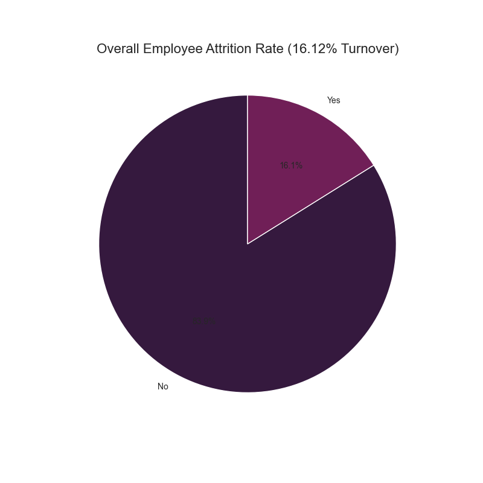

# HR Employee Attrition Analysis: Driving Retention Through Data

###### AI Assistance Acknowledgement 🤖

* This project utilised AI assistance for various aspects, including code generation, debugging, and content drafting.

## Project Overview 📊

This project delivers a comprehensive, data-driven analysis of employee attrition. Leveraging a simulated HR dataset, I identify critical factors influencing employee turnover, offering actionable insights to enhance retention strategies and foster a more stable and productive workforce. This analysis transforms raw data into a strategic tool for HR and leadership.

## Business Challenge & Objectives 🎯

Employee attrition poses significant challenges, impacting operational continuity, recruitment costs, and team morale. This analysis addresses the strategic imperative to understand and mitigate these risks. My core objectives were to:

* **Quantify Turnover:** Accurately measure the overall attrition rate and benchmark it against industry trends.

* **Identify Attrition Hotspots:** Pinpoint specific demographic segments, departments, and job roles exhibiting elevated turnover.

* **Uncover Root Causes:** Investigate the correlation between work environment, compensation, career development, employee satisfaction, and attrition.

* **Formulate Strategic Recommendations:** Translate data findings into clear, actionable recommendations for HR, aimed at improving employee retention and engagement.

## Data Source 📁

The analysis is based on the WA_Fn-UseC_-HR-Employee-Attrition.csv dataset, a simulated HR Analytics Sample Dataset often used for educational and demonstration purposes.

## Potential Dataset Drawbacks ⚠️

* The attrition data involved does not indicate whether the attrition is voluntary attrition (e.g., resignation) or involuntary attrition (e.g., dismissal). This distinction is crucial for targeted HR interventions.

* The dataset was uploaded and last updated 8 years ago, which may lead to some outdated takeaways concerning current industry benchmarks. However, it effectively demonstrates the immense business and strategic potential HR data holds for addressing underutilised HR data and providing new insights in the evolving HR professional landscape driven by AI and Big Data.

## Methodology & Approach 💻

My analysis followed a rigorous, multi-stage methodology to ensure robust and reliable insights:

### 1. Data Preparation & Feature Engineering:

* Initial data inspection confirmed 0 duplicate entries and minimal missing values (5 in the derived AgeGroup).

* Redundant columns were removed to streamline the dataset.

* Ordinal variables (e.g., Education, Satisfaction Levels) were mapped to descriptive labels for enhanced interpretability.

* Age groups were categorized (18-30, 31-40, 41-50, 51+) to facilitate demographic analysis.

* Categorical features were appropriately encoded to prepare the dataset for quantitative analysis.

### 2. Exploratory Data Analysis (EDA):

* Comprehensive descriptive statistics were generated for all numerical variables, providing a foundational understanding of the workforce.

* In-depth cross-tabulations were performed to analyse attrition rates across key categorical dimensions (gender, marital status, department, job role, business travel, overtime).

* Mean comparisons of numerical features revealed significant differences between employees who stayed and those who left.

### 3. Advanced Visualisation:

A suite of visualisations (pie charts, bar charts, box plots, histograms, correlation heatmaps) was created to intuitively present complex relationships and trends. These visuals are integral to the data storytelling process.

### 4. Insight Synthesis & Actionable Recommendations:

All findings were meticulously synthesised to identify primary attrition drivers.

Strategic and actionable recommendations were developed, directly addressing the identified challenges to enable proactive HR interventions.

## Key Findings & Insights 💡

Our analysis illuminates critical areas demanding HR's strategic attention to mitigate employee turnover:

1. **Overall Turnover Remains Consistent:** 

* The organisation experiences a 16.12% attrition rate. For context, in 2017, the technology (software) sector experienced a turnover rate of 13.2% (according to LinkedIn data). While the dataset's age means direct comparisons may be outdated, it still highlights the continuous challenge of retention.

2. **Demographic Flight Risks:**

* Single employees represent a significant flight risk, exhibiting an attrition rate of 25.53%. This is more than double the rate for married (12.48%) or divorced (10.09%) colleagues, suggesting unique retention needs for this group. 

* The youngest age group (18-30 years) shows the highest turnover at 27.91%, underscoring a critical challenge in retaining early-career talent.

3. **High-Impact Operational Stressors:**

* Sales Representatives face an alarming attrition rate of 39.76%, making this role an immediate priority for retention efforts. The Sales department overall also shows a higher turnover at 20.63%.

* Overtime is a clear driver of turnover: Employees working overtime demonstrate a significantly higher attrition rate of 30.53% compared to 10.44% for those not working overtime. This signals potential burnout and demands review of workload distribution.

* Frequent business travel (24.91% attrition) and longer commutes (average of 10.63 miles for leavers vs. 8.92 for stayers) are also notable contributors to attrition.

4. **Compensation & Career Path Influence:**

* The absence of stock options (Level 0) correlates with a substantially higher attrition rate (24.41%), indicating that equity or long-term incentives could be powerful retention levers.

* Employees who leave typically have shorter tenure with the company (average 5.13 years vs. 7.37 for stayers) and with their current managers (average 2.85 years vs. 4.37 for stayers). This highlights the importance of early-career engagement and stable managerial relationships.

* A slower pace of promotions also correlates with higher attrition, as leavers had, on average, fewer years since their last promotion (1.95 years vs. 2.23 for stayers).

5. **Satisfaction as a Leading Indicator:**

* A strong inverse correlation exists between employee satisfaction levels and attrition. For instance, employees with 'Low' Job Satisfaction show 22.84% attrition, significantly higher than those with 'Very High' satisfaction (11.33%).

* Similarly, 'Low' Environment Satisfaction sees 25.35% attrition.

* 'Low' Relationship Satisfaction leads to 20.65% attrition.

* A 'Bad' Work-Life Balance is associated with the highest attrition at 31.25%.

* Low Job Involvement (33.73% attrition) also points to disengagement as a significant predictor of turnover.

## Other Key Visualisations 📈

Beyond attrition drivers, these charts provide further context on workforce demographics and compensation:

* **Monthly Income Distribution by Job Level**

Showcasing the compensation structure across different career levels.

* **Correlation Matrix of Numeric Features**
 
Revealing interdependencies between various quantitative employee attributes.

## Strategic HR Recommendations 🚀

Based on these compelling findings, we propose the following strategic recommendations to bolster employee retention:

* **Develop Targeted Retention Programs:** 

Implement specialised mentorship, career acceleration, and community-building initiatives specifically for young (18-30) and single employees. Tailored engagement strategies are crucial for these high-risk groups.

* **Conduct Role-Specific Audits:** 

Launch immediate, deep-dive investigations into the workload, compensation equity, and career development opportunities within Sales Representative and Laboratory Technician roles. Adjustments to compensation, workload management, or clear promotion pathways may be necessary.

* **Optimise Work-Life Balance Policies:** 

Review and enhance flexible work arrangements, remote work options, and implement stricter controls on overtime to mitigate burnout. This is particularly critical for roles experiencing high overtime.

* **Enhance Employee Investment & Incentives:** 

Re-evaluate and potentially broaden stock option eligibility or explore other long-term incentive programs to increase employee loyalty and perceived value.

* **Strengthen Managerial Effectiveness:** 

Invest in comprehensive managerial training programs focused on fostering strong employee relationships, providing consistent feedback, and actively supporting team members' career growth within their roles and the company.

* **Proactive Satisfaction Management:** 

Establish a more frequent and robust system for collecting employee satisfaction feedback. Crucially, ensure that feedback, especially from areas with low satisfaction scores, is promptly analysed and translated into concrete organisational improvements.

**Author: Lindsey C** 

[LinkedIn Profile](https://www.linkedin.com/in/lilingxi-chen/)

[GitHub Profile](https://github.com/LindseyC-0)
